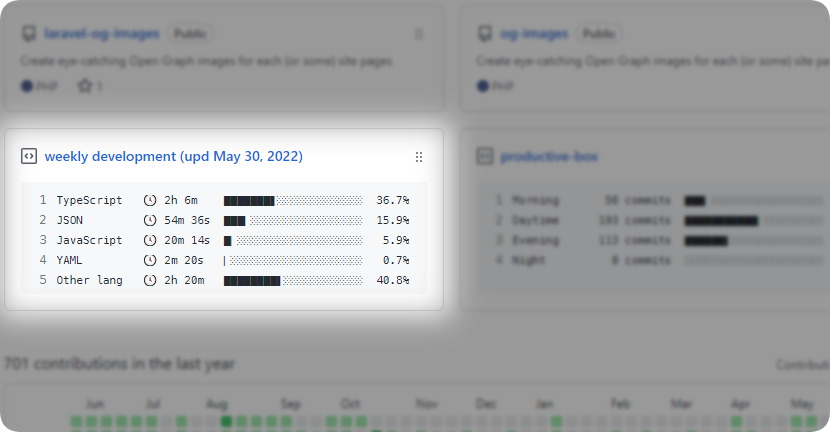

# WakaTime Statistics in your GitHub profile

Automatically update your pinned gist with weekly (monthly, yearly) WakaTime statistics.

[▶ **See example**](https://github.com/abordage)

wip

## Feedback

Find a bug or have a feature request? Open an issue, or better yet, submit a pull request - contribution welcome!

## Contributing

Please see [CONTRIBUTING](https://github.com/abordage/.github/blob/master/CONTRIBUTING.md) for details.

## Credits

- Pavel Bychko ([abordage](https://github.com/abordage))
- [All Contributors](https://github.com/abordage/wakatime-box/graphs/contributors)

## Inspired From
- [matchai/waka-box](https://github.com/matchai/waka-box)
- [matchai/maxam2017/productive-box](https://github.com/maxam2017/productive-box)
- and other [awesome pinned-gist project](https://github.com/matchai/awesome-pinned-gists)

## License

The MIT License (MIT). Please see [License File](LICENSE.md) for more information.
